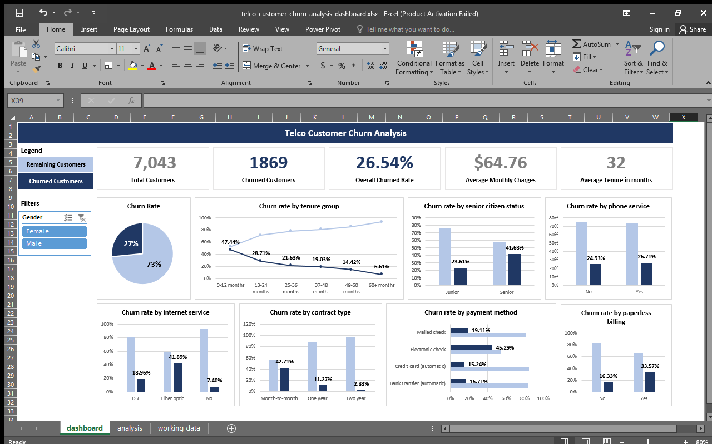
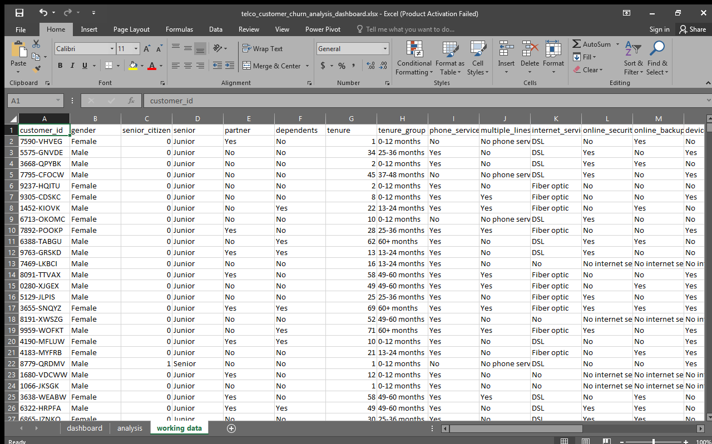
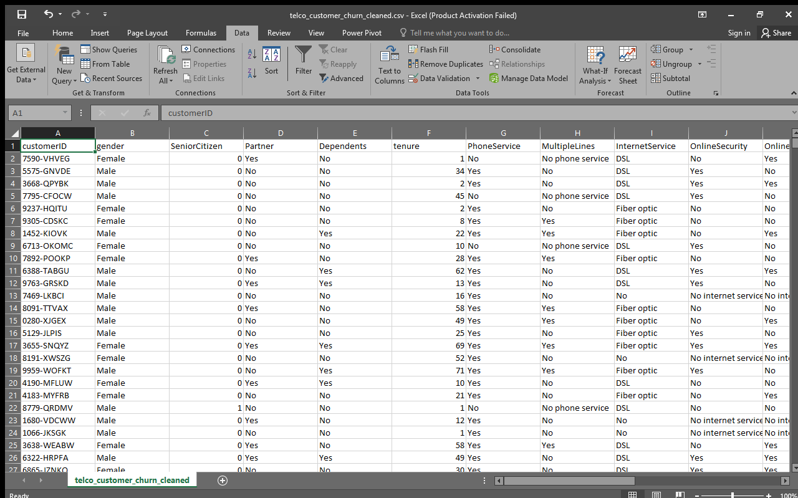
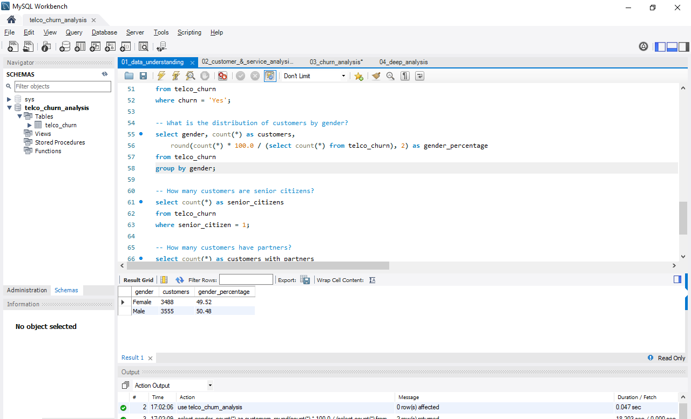
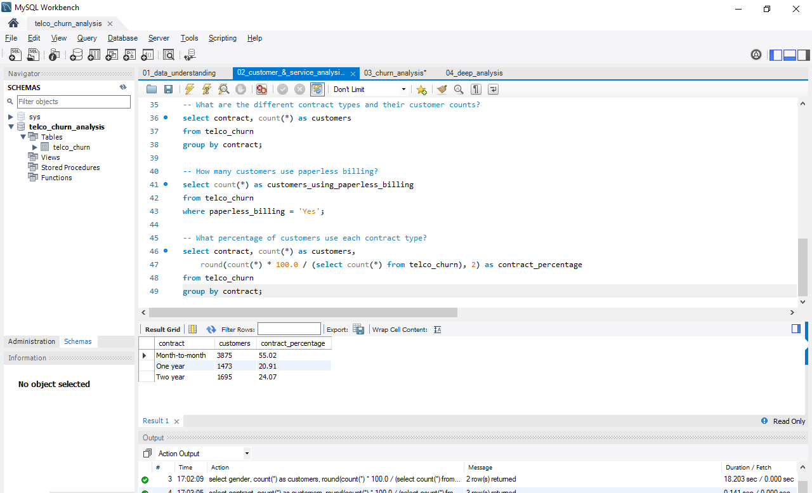
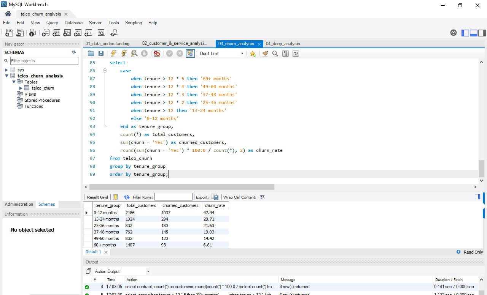
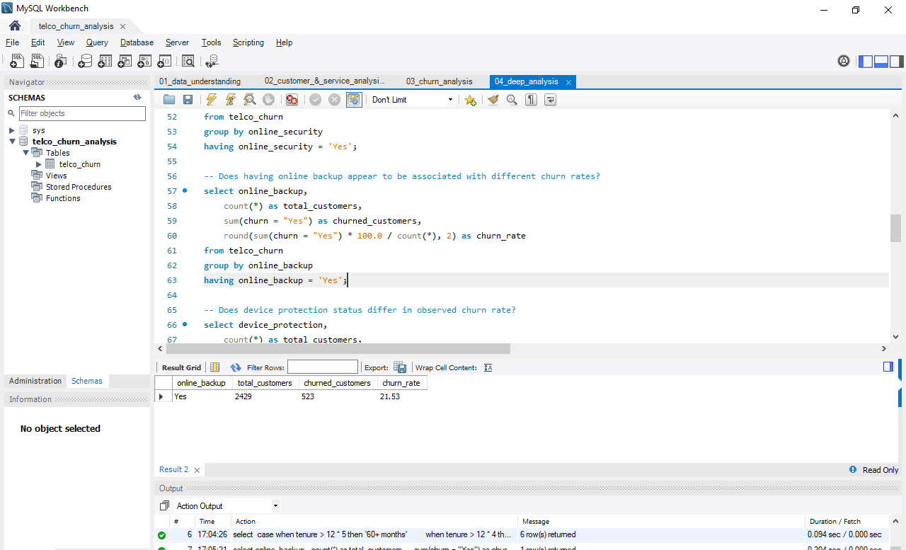
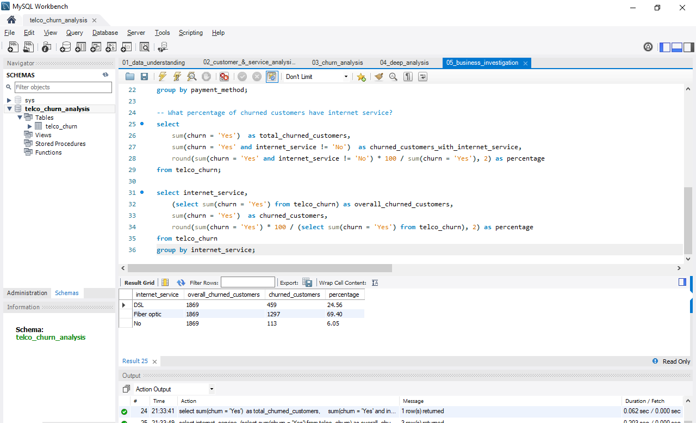
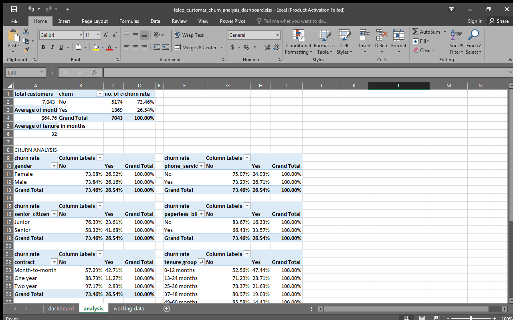

# Telco Customer Churn Analysis

An end-to-end customer churn analysis project using **MySQL, Excel, and data visualization** to identify patterns associated with customer churn and highlight customer segments that may require retention attention.

## Business Question

> **Why are customers leaving the telecom company, and what factors are associated with customer churn?**

The analysis moves from basic data understanding to customer/service analysis, churn-rate comparisons, deeper investigation, and business-focused questions.

## Project Overview

| Item | Details |
|---|---|
| Customers | 7,043 |
| Columns | 21 |
| Churned customers | 1,869 |
| Retained customers | 5,174 |
| Overall churn rate | 26.54% |
| Average tenure | 32.37 months |
| Average monthly charge | $64.76 |
| Average total charge | $2,279.73 |
| SQL | MySQL |
| Spreadsheet analysis | Microsoft Excel |
| Visualization | Excel dashboard |

## Project Structure

```text
Telco Customer Churn/
├── README.md
├── business_question.md
├── understand_the_dataset.md
├── data/
│   ├── telco_customer_churn.csv
│   └── telco_customer_churn_cleaned.csv
├── sql/
│   ├── 01_data_understanding.sql
│   ├── 02_customer_&_service_analysis.sql
│   ├── 03_churn_analysis.sql
│   ├── 04_deep_analysis.sql
│   └── 05_business_investigation.sql
├── dashboard/
│   └── telco_customer_churn_analysis_dashboard.xlsx
└── screenshots/
    ├── 01.png
    ├── 02.png
    ├── 03.png
    ├── 04.png
    ├── 05.png
    ├── analysis_tables.png
    ├── cleaned_data.png
    ├── dashboard.png
    └── working_data.png
```

## Dataset

The dataset contains customer demographic information, tenure, subscribed services, contract and billing details, charges, and a churn indicator.

### Main column groups

- **Customer information:** customer ID, gender, senior-citizen status, partner, dependents
- **Customer relationship:** tenure
- **Services:** phone service, multiple lines, internet service, online security, online backup, device protection, tech support, streaming TV, streaming movies
- **Account and billing:** contract, paperless billing, payment method, monthly charges, total charges
- **Target variable:** churn

## Data Cleaning

The cleaned dataset was prepared before analysis.

Key checks and cleaning decisions include:

- Standardized column names to `snake_case`.
- Converted `total_charges` to a numeric field.
- Checked for duplicate `customer_id` values.
- Checked all 21 columns for missing values.
- Investigated customers with zero tenure and/or zero total charges.
- Retained legitimate new customers with zero tenure rather than treating them as errors.
- Kept `No internet service` as a distinct category instead of converting it to `No`.

### Why keep `No internet service`?

`No` and `No internet service` describe different situations. A customer can have internet service but not subscribe to a particular add-on, while another customer may not have internet service at all. Keeping the distinction preserves useful information for churn analysis.

## Analysis Process

### Level 1 — Data Understanding

Basic dataset structure and quality checks:

- Customer and column counts
- Duplicate customer IDs
- Missing-value checks
- Churn count and overall churn rate
- Customer demographics

### Level 2 — Customer & Service Analysis

Explores:

- Average tenure
- Average monthly and total charges
- Phone and internet service adoption
- Internet service types
- Payment methods
- Contract types
- Paperless billing

### Level 3 — Churn Analysis

Calculates observed churn rates by:

- Gender
- Senior-citizen status
- Partner/dependent status
- Phone service
- Internet service
- Contract type
- Payment method
- Paperless billing
- Tenure group

### Level 4 — Deeper Analysis

Investigates higher-level relationships between churn and:

- Contract type
- Payment method
- Internet service
- Tech support
- Online security
- Online backup
- Device protection
- Streaming services
- Monthly-charge ranges
- Tenure groups

The service comparisons were corrected so that each query returns **all relevant groups**, rather than filtering to only customers who have the service. This makes the churn-rate comparisons meaningful.

### Level 5 — Business Investigation

Focuses on the business impact of the observed patterns, including the contribution of major customer segments to total churn.

## Key Findings

### Contract type is strongly associated with observed churn

| Contract | Observed churn rate |
|---|---:|
| Month-to-month | **42.71%** |
| One year | 11.27% |
| Two year | 2.83% |

Month-to-month customers have a substantially higher observed churn rate than customers on longer contracts.

### Payment method shows a notable difference

| Payment method | Observed churn rate |
|---|---:|
| Electronic check | **45.29%** |
| Mailed check | 19.11% |
| Bank transfer (automatic) | 16.71% |
| Credit card (automatic) | 15.24% |

Electronic-check customers have the highest observed churn rate among the payment-method groups.

### Internet service is also associated with different churn rates

| Internet service | Observed churn rate |
|---|---:|
| Fiber optic | **41.89%** |
| DSL | 18.96% |
| No internet service | 7.40% |

### Tenure matters

Customers in earlier tenure groups show higher observed churn than customers who have stayed with the company for longer periods. This suggests that the early customer lifecycle deserves particular retention attention.

### Service add-ons show meaningful differences

Customers without services such as tech support, online security, online backup, and device protection generally show higher observed churn rates than customers who subscribe to those services. These are associations in this dataset, not proof that the services themselves cause lower churn.

## Business Implications

Based on the observed patterns, the business could investigate:

1. **Early-tenure retention:** strengthen onboarding and engagement during the first year.
2. **Month-to-month customers:** identify reasons for short-term contracts and test incentives for longer commitments.
3. **Electronic-check customers:** investigate payment experience, billing friction, and customer characteristics behind this segment's high churn.
4. **Fiber-optic customers:** investigate whether pricing, service quality, expectations, or customer mix contributes to the higher observed churn rate.
5. **Retention services:** examine whether support and security add-ons are associated with stronger customer retention.

These findings identify areas for further investigation. They should not be interpreted as causal conclusions without additional analysis or experimentation.

## Tools Used

- **MySQL / MySQL Workbench** — data querying, aggregation, segmentation, and churn analysis
- **Microsoft Excel** — data preparation, analysis tables, and dashboarding
- **SQL** — data-quality checks, churn-rate calculations, grouping, conditional aggregation, and business analysis

## Dashboard Preview



The dashboard summarizes the main churn patterns across contract type, tenure, internet service, payment method, and customer/service characteristics.

## Project Screenshots

The screenshots below document the project workflow from the working dataset through cleaning, SQL analysis, analysis tables, and the final dashboard.

### Working Data



### Data Cleaning



### SQL Analysis











### Analysis Tables



### Final Dashboard


## What This Project Demonstrates

This project demonstrates practical ability to:

- Understand and clean a real-world tabular dataset
- Perform data-quality checks
- Write SQL queries for business questions
- Calculate churn rates and customer segments
- Compare customer groups using conditional aggregation
- Translate analytical results into business insights
- Build a dashboard from analyzed data
- Document an end-to-end data-analysis workflow

## Important Note

A higher observed churn rate indicates an association in this dataset. It does **not** establish that a particular customer characteristic or service causes churn.
